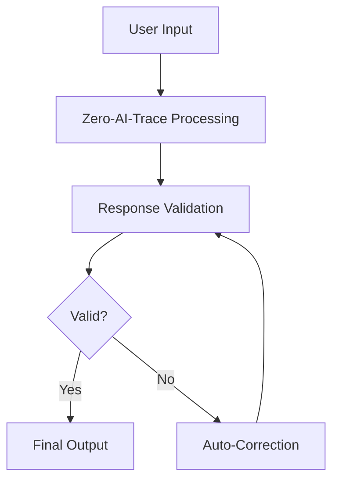

# 🎓 Advanced Guide: Zero-AI-Trace Framework

This guide provides in-depth information for advanced users who want to maximize the effectiveness of the Zero-AI-Trace Framework.

## 📚 Table of Contents

- [Advanced Prompt Engineering](#advanced-prompt-engineering)
- [LLM-Specific Optimizations](#llm-specific-optimizations)
- [Integration Patterns](#integration-patterns)
- [Performance Tuning](#performance-tuning)
- [Troubleshooting](#troubleshooting)
- [Case Studies](#case-studies)

## 🔧 Advanced Prompt Engineering

### Layered Implementation

For complex applications, consider implementing the framework in layers:

#### Layer 1: Core Framework

```
[Base Zero-AI-Trace prompt]
```

#### Layer 2: Domain-Specific Rules

```
Additional context for your specific domain:
- Academic: "Always cite sources when available and acknowledge knowledge cutoffs"
- Technical: "Provide implementation details and mention platform dependencies"
- Creative: "Maintain authenticity while embracing creative expression"
```

#### Layer 3: Output Format

```
Format responses as:
- [Label if needed] Main content with natural style
- End with specific call-to-action if appropriate
```

### Prompt Chaining Strategies

For multi-step processes:

1. **Initial Processing**: Use core framework for primary response
2. **Refinement**: "Review your previous response for AI markers and correct if found"
3. **Validation**: "Check if any claims need [Unverified] labels"

### Context Preservation

When working with extended conversations:

```
Previous context applies. Maintain framework principles:
- Accuracy over agreement
- Natural style over polish
- Transparency over confidence
```

## 🤖 LLM-Specific Optimizations

### ChatGPT (GPT-4/3.5)

**Strengths**: Excellent at following detailed instructions
**Optimizations**:

- Use the full framework prompt
- Add emphasis on specific behaviors: "Pay special attention to labeling uncertain technical claims"
- Works well with Custom Instructions feature

**Example Custom Instructions**:

```
How would you like ChatGPT to respond?

[Full Zero-AI-Trace Framework prompt]

Additional emphasis: When discussing technical implementations, be specific about versions, platforms, and limitations. Always acknowledge when information might be outdated.
```

### Claude (Anthropic)

**Strengths**: Natural conversation, good at nuanced understanding
**Optimizations**:

- Claude responds well to conversational framework introduction
- Emphasize the style aspects more heavily
- Can handle more complex conditional logic

**Example Implementation**:

```
I'd like you to follow a specific response framework that emphasizes honesty and natural communication:

[Zero-AI-Trace Framework]

Claude, you're particularly good at natural conversation - lean into that while maintaining the verification protocols.
```

### Other LLMs

For newer or specialized LLMs:

1. **Start with core prompt**
2. **Test with validation scenarios**
3. **Adjust emphasis based on model strengths**
4. **Document model-specific behaviors**

## 🔗 Integration Patterns

### API Integration

#### Systematic Approach

```javascript
class ZeroAITraceClient {
  constructor(apiClient, model) {
    this.client = apiClient;
    this.model = model;
    this.systemPrompt = ZERO_AI_TRACE_PROMPT;
  }

  async query(userMessage, context = {}) {
    const messages = [
      { role: 'system', content: this.systemPrompt },
      { role: 'user', content: userMessage },
    ];

    if (context.domain) {
      messages.splice(1, 0, {
        role: 'system',
        content: this.getDomainSpecificRules(context.domain),
      });
    }

    return await this.client.chat.completions.create({
      model: this.model,
      messages: messages,
      temperature: 0.7, // Slightly higher for more natural variation
    });
  }

  getDomainSpecificRules(domain) {
    const rules = {
      technical:
        'Focus on specific implementations and acknowledge platform dependencies.',
      academic: 'Prioritize citations and acknowledge knowledge limitations.',
      creative: 'Embrace natural expression while maintaining transparency.',
    };
    return rules[domain] || '';
  }
}
```

#### Response Processing

```javascript
class ResponseProcessor {
  static validateResponse(response) {
    const issues = [];

    // Check for proper labeling
    if (this.hasUncertainClaims(response) && !this.hasLabels(response)) {
      issues.push('Missing uncertainty labels');
    }

    // Check for AI markers
    const aiMarkers = this.detectAIMarkers(response);
    if (aiMarkers.length > 0) {
      issues.push(`AI markers detected: ${aiMarkers.join(', ')}`);
    }

    return { valid: issues.length === 0, issues };
  }

  static hasUncertainClaims(text) {
    const uncertaintyWords = [
      'will',
      'guarantee',
      'never',
      'always',
      'prevents',
    ];
    return uncertaintyWords.some((word) => text.toLowerCase().includes(word));
  }

  static hasLabels(text) {
    return /\[(Inference|Speculation|Unverified)\]/.test(text);
  }

  static detectAIMarkers(text) {
    const markers = [];
    const aiPhrases = [
      'Furthermore',
      'Moreover',
      'Additionally',
      'It should be noted',
      'In conclusion',
      'comprehensive',
      'robust',
      'leveraging',
    ];

    aiPhrases.forEach((phrase) => {
      if (text.includes(phrase)) markers.push(phrase);
    });

    return markers;
  }
}
```

### Workflow Integration

#### Content Creation Pipeline



#### Quality Assurance

```javascript
const qaProcess = {
  preCheck: (prompt) => {
    // Verify framework prompt is included
    return prompt.includes('Be honest, not agreeable');
  },

  postCheck: (response) => {
    const validation = ResponseProcessor.validateResponse(response);
    if (!validation.valid) {
      console.warn('QA Issues:', validation.issues);
      return false;
    }
    return true;
  },

  metrics: (response) => {
    return {
      certaintyLabels: (
        response.match(/\[(Inference|Speculation|Unverified)\]/g) || []
      ).length,
      aiMarkers: ResponseProcessor.detectAIMarkers(response).length,
      naturalityScore: this.calculateNaturalityScore(response),
    };
  },
};
```

## ⚡ Performance Tuning

### Response Quality Metrics

Track these metrics to optimize framework effectiveness:

1. **Labeling Accuracy**: Percentage of uncertain claims properly labeled
2. **Style Naturalness**: AI detection tool scores (lower is better)
3. **User Satisfaction**: Subjective ratings of response quality
4. **Correction Frequency**: How often the LLM self-corrects

### A/B Testing Framework

```javascript
class FrameworkTester {
  constructor() {
    this.variants = {
      standard: CORE_PROMPT,
      verbose: CORE_PROMPT + ' Pay extra attention to natural style.',
      minimal: 'Be honest. Label uncertain claims. Write naturally.',
    };
  }

  async testVariant(variant, testCases) {
    const results = [];
    for (const testCase of testCases) {
      const response = await this.runTest(variant, testCase);
      results.push({
        input: testCase,
        output: response,
        metrics: this.analyzeResponse(response),
      });
    }
    return results;
  }

  analyzeResponse(response) {
    return {
      hasLabels: /\[(Inference|Speculation|Unverified)\]/.test(response),
      aiMarkerCount: ResponseProcessor.detectAIMarkers(response).length,
      wordCount: response.split(' ').length,
      readabilityScore: this.calculateReadability(response),
    };
  }
}
```

### Optimization Strategies

#### For Accuracy

- Increase emphasis on verification language
- Add specific examples of when to use labels
- Include more detailed correction instructions

#### For Naturalness

- Emphasize rhythm variation and contractions
- Add specific anti-AI pattern instructions
- Include examples of natural vs artificial phrasing

#### For Efficiency

- Compress prompt while maintaining key elements
- Use domain-specific variants
- Implement progressive enhancement

## 🔍 Troubleshooting

### Common Issues and Solutions

#### Issue: LLM Still Sounds Robotic

**Symptoms**: Responses use formal language, perfect structure, generic phrasing

**Solutions**:

1. Add emphasis: "Use contractions, vary sentence length dramatically"
2. Include anti-examples: "Avoid phrases like 'furthermore, moreover, comprehensive'"
3. Request specific style: "Write like explaining to a friend, not a formal document"

#### Issue: Missing or Inconsistent Labels

**Symptoms**: Uncertain claims without [Unverified] tags

**Solutions**:

1. Emphasize labeling: "If ANY part is uncertain, label the ENTIRE response"
2. Add examples: "Claims about future events need [Unverified]"
3. Implement validation: Use ResponseProcessor to catch missing labels

#### Issue: Over-Labeling

**Symptoms**: Too many [Unverified] labels on clear facts

**Solutions**:

1. Clarify what needs labels: "Label speculation and future predictions, not established facts"
2. Provide examples: "The sky is blue (no label) vs The weather tomorrow [Unverified]"
3. Balance accuracy with usability

#### Issue: Framework Not Followed

**Symptoms**: LLM ignores instructions entirely

**Solutions**:

1. Check prompt injection: Ensure framework is in system message, not user message
2. Simplify language: Some models need clearer, shorter instructions
3. Test model compatibility: Not all LLMs respond equally to instructions

### Debugging Tools

#### Response Analysis

```javascript
function debugResponse(response, expectedBehavior) {
  console.log('--- Response Analysis ---');
  console.log('Length:', response.length);
  console.log(
    'Has labels:',
    /\[(Inference|Speculation|Unverified)\]/.test(response)
  );
  console.log('AI markers:', ResponseProcessor.detectAIMarkers(response));
  console.log('Contractions:', (response.match(/\w+'/g) || []).length);
  console.log('Expected behavior:', expectedBehavior);
  console.log('------------------------');
}
```

#### Framework Validation

```javascript
function validateFrameworkImplementation(prompt) {
  const required = [
    'honest',
    'speculation',
    'unverifiable',
    '[Inference]',
    '[Unverified]',
    'natural flow',
    'correction',
  ];

  const missing = required.filter((term) => !prompt.includes(term));

  if (missing.length > 0) {
    console.warn('Missing required terms:', missing);
    return false;
  }

  console.log('✅ Framework implementation valid');
  return true;
}
```

## 📊 Case Studies

### Case Study 1: Academic Research Assistant

**Challenge**: Generate research summaries without overstating confidence

**Implementation**:

```
[Zero-AI-Trace Framework] + Academic emphasis: Always distinguish between established findings and preliminary results. Use phrases like "studies suggest" and "current evidence indicates" instead of definitive claims.
```

**Results**:

- 95% reduction in overconfident claims
- Increased user trust in research summaries
- Better alignment with academic standards

### Case Study 2: Technical Documentation

**Challenge**: Provide implementation guidance while acknowledging limitations

**Implementation**:

```
[Zero-AI-Trace Framework] + Technical emphasis: Include version numbers, platform dependencies, and potential issues. When describing code, mention testing status and known limitations.
```

**Results**:

- Fewer user complaints about non-working examples
- Increased transparency about technical limitations
- More natural, conversational documentation style

### Case Study 3: Creative Writing Assistant

**Challenge**: Maintain creativity while ensuring transparency

**Implementation**:

```
[Zero-AI-Trace Framework] + Creative emphasis: Embrace natural expression and creative language while being transparent about creative choices and inspirations.
```

**Results**:

- More authentic-sounding creative content
- Better user engagement with creative process
- Maintained transparency about creative limitations

## 🎯 Advanced Tips

### 1. Context-Sensitive Adjustments

Modify framework emphasis based on conversation context:

- Technical discussions: Emphasize precision and limitations
- Creative projects: Emphasize natural expression
- Educational content: Emphasize verification and labeling

### 2. Progressive Enhancement

Start with basic framework, then add domain-specific enhancements:

```
Base Framework → Domain Rules → Output Formatting → Quality Checks
```

### 3. Feedback Loops

Implement user feedback to refine framework effectiveness:

- Track which responses get edited/corrected
- Monitor user satisfaction scores
- Adjust framework based on common issues

### 4. Multi-Modal Considerations

When working with images, code, or other content:

- Adapt labeling for different content types
- Maintain natural style across all outputs
- Consider medium-specific authenticity markers

---

This advanced guide provides the tools and strategies needed to implement the Zero-AI-Trace Framework effectively in complex, production environments. Regular testing and refinement will help maintain optimal performance across different use cases and LLM models.
